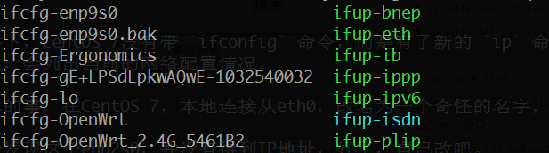
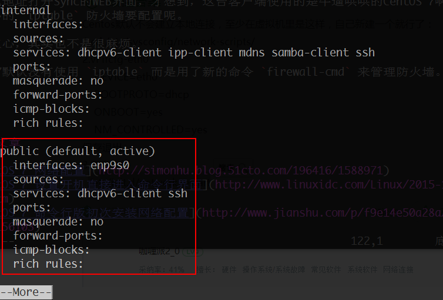

## 文章更新

1. 20160901-初次成文

## 为什么会有这篇文章

最近发现随着共享文件的增多，树莓派的IO问题暴露出来了，而且用了新版本的Resilio Sync，CPU占用非常的高，也许他们版本更新会解决这个问题，但是工作不能等，还是的找个方法继续做共享。正好自己有一台笔记本放着也是放着，用来当服务器了，接个外接硬盘，这样即便是以后换其他客户端，里面的文件也可以拔下来硬盘就换主机。因为笔记本用的CENTOS7系统，所以还是有很多地方和CENTOS6不大一样的，记录一下也有好处。<!-- more -->

## 准备工作：关掉桌面GUI

也许是最近LINUX用的多了，所以觉得除了WINDOWS其他的桌面用着非常不习惯，尤其是有命令行的时候，用鼠标点来点去的感觉有点隔靴搔痒的感觉，索性启动直接进入命令行就好了。

命令也简单

``` bash
systemctl set-default multi-user.target #命令模式
systemctl set-default graphical.target #图形模式
```

如果问为什么，可以稍微多了解一些，如果查看 `/etc/inittab` 这个文件，会看到下面的内容

``` bash
# inittab is no longer used when using systemd.
#
# ADDING CONFIGURATION HERE WILL HAVE NO EFFECT ON YOUR SYSTEM.
#
# Ctrl-Alt-Delete is handled by /etc/systemd/system/ctrl-alt-del.target
#
# systemd uses 'targets' instead of runlevels. By default, there are two main targets:
#
# multi-user.target: analogous to runlevel 3
# graphical.target: analogous to runlevel 5
#
# To set a default target, run:
#
# ln -sf /lib/systemd/system/<target name>.target /etc/systemd/system/default.target
#
```

提示说inittab文件已经不被使用，现在CentOS7使用systemd作为新的init系统，而systemd系统使用 `target` 来代替 `runlevel`，默认有两个主要的target：

multi-user.target：相当于runlevel 3[命令行界面]，graphical.target：相当于runlevel 5[图形界面]

设置默认的target则使用命令：

``` bash
ln -sf /lib/systemd/system/<target name>.target /etc/systemd/system/default.target
```

我这里要将CentOS7开机默认进入命令行界面，则运行命令：

``` bash
ln -sf /lib/systemd/system/multi-user.target /etc/systemd/system/default.target
```
如果要改回图形界面，则运行命令：

``` bash
ln -sf /lib/systemd/system/graphical.target /etc/systemd/system/default.target
```

我得承认，上面的两种命令，具体的异同，我还不是很明白。

## 设置本地连接

因为要用这个电脑做NAS的功能，所以还是用有线连接更为可靠一些。CentOS 7默认是没有开启本地连接的，意思就是你就算插上了网线，也不会自动分配上网的IP地址，需要自己手动配置。

初始条件下，CentOS 7没有带 `ifconfig` 命令，而是有了新的 `ip` 命令，所以先输入 `ip addr`，会列出当前的网络配置情况。

> 有意思的事，在CentOS 7，本地连接从eth0，改名为一个奇怪的名字，我的是enp9s0。

然后你会发现这个enp9s0，并没有得到IP地址，好了，自己改吧。

先去 /etc/sysconfig/network-scripts 目录下，看看网卡的配置文件名。

``` bash
ls /etc/sysconfig/network-scripts/
```



就是图片上那个第一个文件就是本地网卡的配置文件。

好了，编辑

``` bash
vim /etc/sysconfig/network-scripts/ifcfg-enp9s0
```

将其中的 `ONBOOT=no` 改为 `ONBOOT=yes`，然后重启电脑 `shutdown -r`，或者重启网络`/etc/init.d/network restart`。(网上还有再使用 `service network restart` 两条一起来的，应该是有所不同，不过目前先不是深究了）。

## 使用静态IP地址

重启之后，再次使用 `ip addr`，可以看到 enp9s0 已经有了IP地址，但是NAS一般要使用静态地址，所以，继续在ifcfg-enp9s0文件上进行修改。

添加下面几行

``` bash
IPADDR0=192.168.10.173
PREFIX0=24
GATEWAY0=192.168.10.1
DNS1=192.168.10.1
```

然后把 `BOOTPROTO=dhcp` 这行给注释掉。再次重启，会看到IP地址已经变了。

## CentOS 7的防火墙

在CentOS 7上安装了Resilio Sync，然后路由器上也做了端口转发，但是其他客户端都无法使用本地地址打开Sync的WEB界面，才想到，这台客户端使用的是牛逼哄哄的CentOS 7啊，还有恶心的 `iptable` 防火墙要配置呢。

不过别担心，其实也不是很麻烦。

CentOS 7默认没有使用 `iptable` 而是用了新的命令 `firewall-cmd` 来管理防火墙。

使用命令 `firewall-cmd --list-all-zones`，会看到列出所有的区域信息，其中 `public`是默认使用且处于活动状态，见下图：



所以，还是需要自己手动添加端口

``` bash
firewall-cmd --add-port=8080/tcp #添加例外端口
firewall-cmd --remove-port=8080/tcp #删除例外端口
firewall-cmd --query-port=8080/tcp #查看例外端口
```

如果想永久添加，加上 `permanent` 参数，如：

``` bash
firewall-cmd --permanent --add-port=8080/tcp
```

另外想设置端口范围的可以这样使用：

``` bash
firewall-cmd --add-port=80-8080/tcp
```

如果想使用iptables可以参考下面例子：

1. 停用firewall：

  ``` bash
  systemctl stop firewalld
  systemctl mask firewalld
  ```

2. 安装 `iptables-services`

  ``` bash
  yum install iptables-services
  ```

3. 设置 `iptables` 开机启动

  ``` bash
  systemctl enable iptables
  ```

4. iptables 控制

  ``` bash
  systemctl [stop|start|restart] iptables
  ```

  或者

  ``` bash 
  service iptables [stop|start|restart]
  ```

5. 保存 iptables 设置

  ``` bash
  service iptables save
  ```

  或者

  ``` bash
  /usr/libexec/iptables/iptables.init save
  ```

值得注意的是，在使用 `man firewall-cmd` 查看官方使用说明的时候，提到了如果要使某个动作立即生效并且重启之后继续生效，需要两条连续的命令

``` bash
firewall-cmd --add-port=8888/tcp #让这个端口立即生效
firewall-cmd --permanent --add-port=8888/tcp #让这个端口在系统重启后依然生效
```

所以，有问题多使用 `man` 命令是个好习惯。

GAME OVER.

## 参考文章

1. [CentOS 7 网络配置](http://simonhu.blog.51cto.com/196416/1588971)
2. [CentOS 7 设置开机直接进入命令行界面](http://www.linuxidc.com/Linux/2015-12/126356.htm)
3. [CentOS 7 命令行版初次安装网络配置](http://www.jianshu.com/p/f9e14e50a28a/comments/1156103)
