## 文章更新

1. 20170414-初次成文
2. 20170425-最终也是没有弄好，暂时放弃
3. 20170728-正式版出了，折腾了一下午装好了

## 为什么会有这篇文章

正式版出了，想起来之前折腾许久也没有装好，决定再尝试安装一下，结果虽然依然不太顺利，但是总算装好了。

## 下载与安装

VS for Mac 软件[下载地址](https://www.visualstudio.com/vs/visual-studio-mac/)

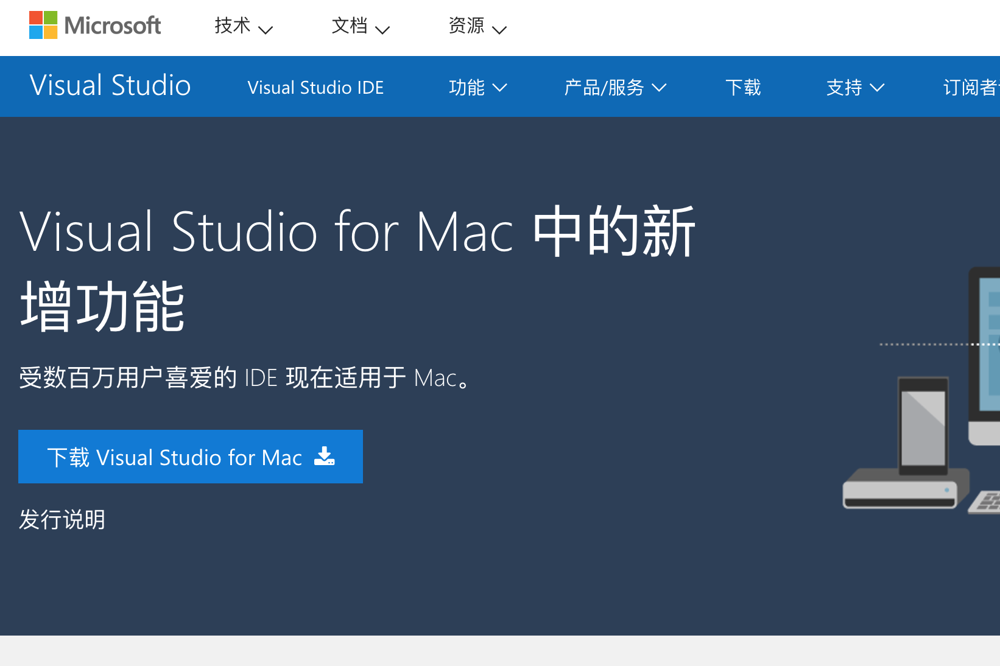

下载后，运行

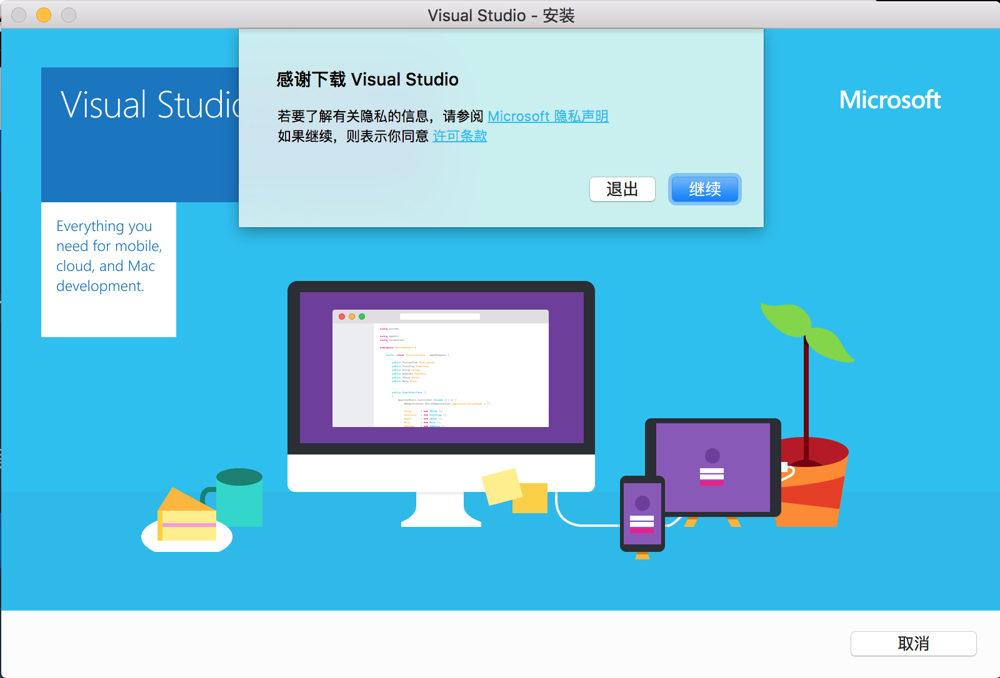

这次的界面和预览版有所改变，第一次安装，全都选中。

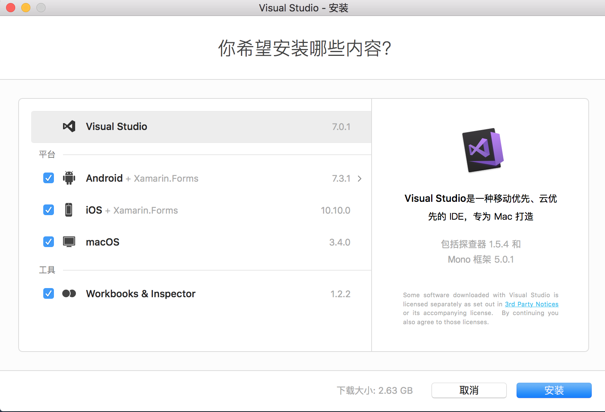

失败了几次，都卡在了Android SDK上，无意中某次重装，发现安装器还发现了.Net Core，后来再安装就没有了，这正式版也是不太靠谱。

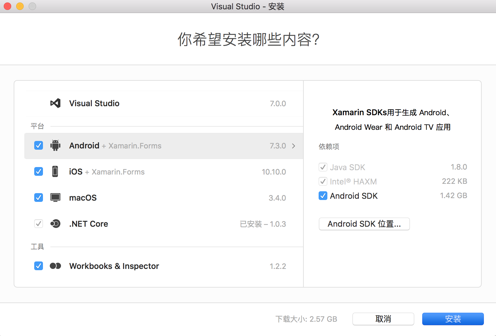

如果安装失败了，点击退出，安装器会提示保存进度，这个功能说好也不好，说好是因为下次重装不用下载2G多内容了，不好的呢？如果你决定放弃安装，占了N多硬盘，你还不知道该怎么清理。

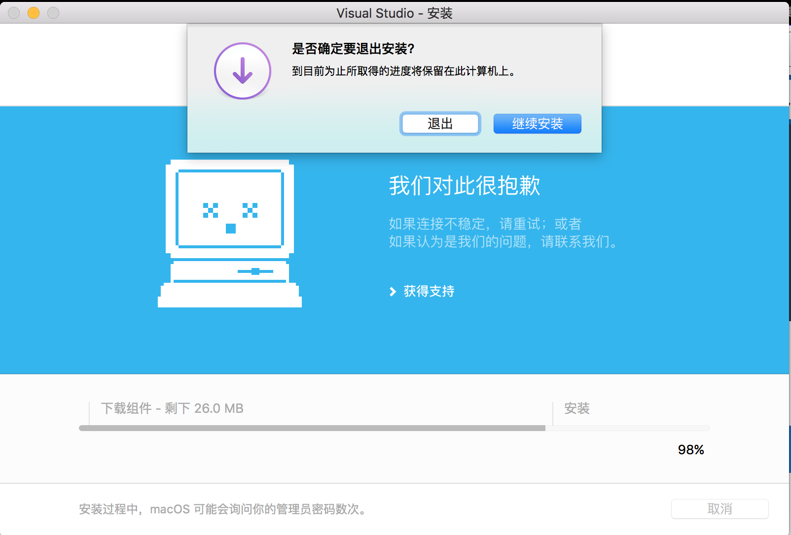

## 通过控制台查看具体失败信息

发现最后卡在了Android上面，可以通过cmd+o打开控制台，查看失败的原因

``` accesslog
[2017-07-29 03:39:30.329] [Debug] Starting installation task.
[2017-07-29 03:39:30.330] [Info] Background installation worker called.
[2017-07-29 03:39:30.330] [Info] Processing software items
[2017-07-29 03:39:30.330] [Info] Skipping installation of software item 'Mono Framework'
[2017-07-29 03:39:30.330] [Info] Skipping installation of software item 'Java SDK'
[2017-07-29 03:39:30.330] [Info] Installing software item 'Android SDK'
[2017-07-29 03:39:30.330] [Debug] Android SDK component 'http://dl-ssl.google.com/android/repository/tools_r25.2.5-macosx.zip' download URL: http://dl-ssl.google.com/android/repository/tools_r25.2.5-macosx.zip
[2017-07-29 03:39:30.330] [Debug] Android SDK component 'http://dl-ssl.google.com/android/repository/build-tools_r25.0.3-macosx.zip' download URL: http://dl-ssl.google.com/android/repository/build-tools_r25.0.3-macosx.zip
[2017-07-29 03:39:30.330] [Debug] Android SDK component 'http://dl-ssl.google.com/android/repository/platform-tools_r25.0.5-darwin.zip' download URL: http://dl-ssl.google.com/android/repository/platform-tools_r25.0.5-darwin.zip
[2017-07-29 03:39:30.330] [Debug] Android SDK component 'http://dl-ssl.google.com/android/repository/platform-23_r03.zip' download URL: http://dl-ssl.google.com/android/repository/platform-23_r03.zip
[2017-07-29 03:39:30.330] [Debug] Android SDK component 'http://dl-ssl.google.com/android/repository/sys-img/google_apis/x86-23_r20.zip' download URL: http://dl-ssl.google.com/android/repository/sys-img/google_apis/x86-23_r20.zip
[2017-07-29 03:39:30.331] [Debug] Android SDK component 'http://dl-ssl.google.com/android/repository/sys-img/google_apis/armeabi-v7a-23_r20.zip' download URL: http://dl-ssl.google.com/android/repository/sys-img/google_apis/armeabi-v7a-23_r20.zip
[2017-07-29 03:39:30.331] [Debug] Android SDK component 'http://dl-ssl.google.com/android/repository/tools_r25.2.5-macosx.zip' download URL: http://dl-ssl.google.com/android/repository/tools_r25.2.5-macosx.zip
[2017-07-29 03:39:30.331] [Debug] Android SDK component 'http://dl-ssl.google.com/android/repository/emulator-darwin-3833124.zip' download URL: http://dl-ssl.google.com/android/repository/emulator-darwin-3833124.zip
[2017-07-29 03:39:30.331] [Debug] Android SDK component 'http://dl-ssl.google.com/android/repository/google_apis-23_r01.zip' download URL: http://dl-ssl.google.com/android/repository/google_apis-23_r01.zip
[2017-07-29 03:39:30.331] [Debug] Android NDK download URL: http://dl-ssl.google.com/android/repository/android-ndk-r14b-darwin-x86_64.zip
[2017-07-29 03:39:30.331] [Info] Android SDK is waiting for download to finish.
[2017-07-29 03:39:30.643] [Debug] Download size for 'http://dl.google.com/android/android-sdk_r24.4.1-macosx.zip': 102781947
[2017-07-29 03:41:11.681] [Exception] Failed to get content size at 'http://dl-ssl.google.com/android/repository/tools_r25.2.5-macosx.zip'
[2017-07-29 03:41:11.681] [Exception] System.Net.WebException: The request timed out
[2017-07-29 03:41:11.681] [Exception] at System.Net.HttpWebRequest.EndGetResponse (System.IAsyncResult asyncResult) [0x00065] in /Library/Frameworks/Xamarin.Mac.framework/Versions/2.10.0.113/src/mono/mcs/class/System/System.Net/HttpWebRequest.cs:1025
[2017-07-29 03:41:11.681] [Exception] at System.Net.HttpWebRequest.GetResponse () [0x0000e] in /Library/Frameworks/Xamarin.Mac.framework/Versions/2.10.0.113/src/mono/mcs/class/System/System.Net/HttpWebRequest.cs:1037
[2017-07-29 03:41:11.681] [Exception] at Xamarin.Components.Ide.Web.RequestHelper.GetResponse (System.Func`1[TResult] createRequest, System.Action`1[T] prepareRequest) [0x0023e] in /Users/builder/data/lanes/5133/752d68f3/source/installer/Xamarin.Web.Installer/MonoDevelop.Core.Web/RequestHelper.cs:83
[2017-07-29 03:41:11.682] [Info] Please file a bug: https://go.microsoft.com/fwlink?linkid=852416
```

最终确定了几个无法下载的软件，可以手动下载，也可以在失败界面，查看失败安装说明，会有详细的安装提示，我就是通过这个提示安装成功的。见图如下。

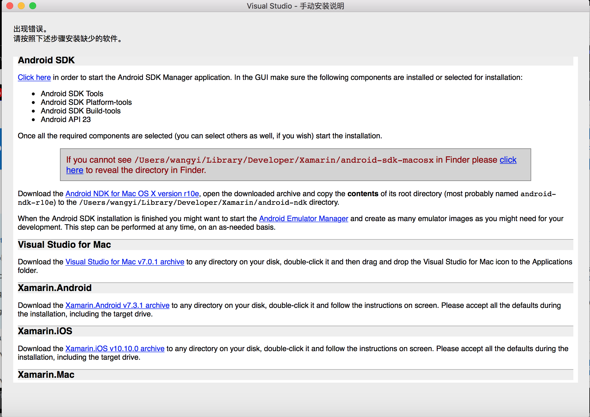

> 说一点题外话，某次安装过程，提示VS for MAC要求将XCODE升级到8.3版本之上。我其实也想升级，无奈8.3的XCODE要求MAC OS对低10.12(sierra)，而我是EI CAPITAN（10.11），如果升级到10.12之后，KARABINER就无法使用了，日本键盘序列的我伤不起啊。

只能期待KARABINER早日支持10.12吧。

不过我决定死马当活马医，装完再说。

## 失败组件的安装
通过手动安装说明，我下载这6个文件。

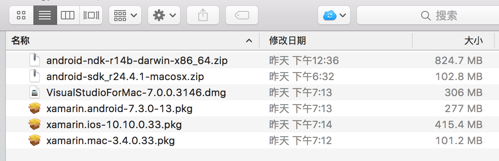

其中2个分别是Android SDK和NDK，3个是Xamarin的分别为开发MAC、Android和IOS而必备的组件，还有一个就是Visual Studio for MAC本尊 -_-...

### Android SDK和NDK手动安装
这个是最麻烦的，其他的几个都含直接安装搞定，略去不说了。

解压缩`android-sdk_r24.4.1-macosx.zip`，得到一个`android-sdk-macoxs`目录，把这个目录移动到`/Users/你的用户名/Library/Developer/Xamarin`目录下，`android-ndk-r14b-darwin-x86_64.zip`也同样解压缩，得到一个`android-ndk`目录，放到同样位置。如下面这样。

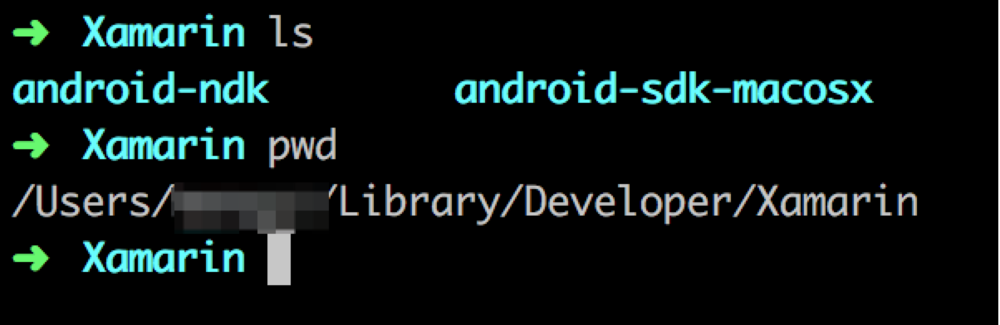

然后到`android-sdk-macosx`-`tools`目录下，运行android程序

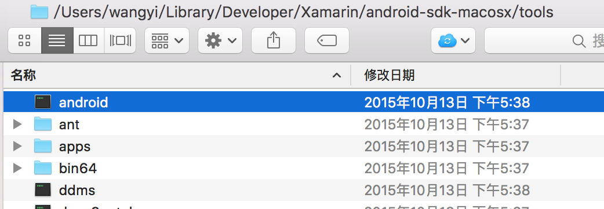

会打开android sdk manager，程序会自动从GOOGLD读取最新的组件列表。

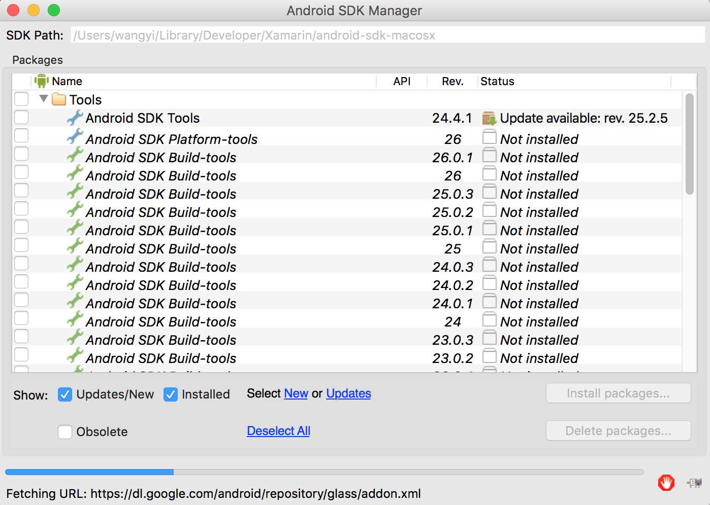

勾选VS FOR MAC要求的3个组件，安装系统缺少的SDK组件。

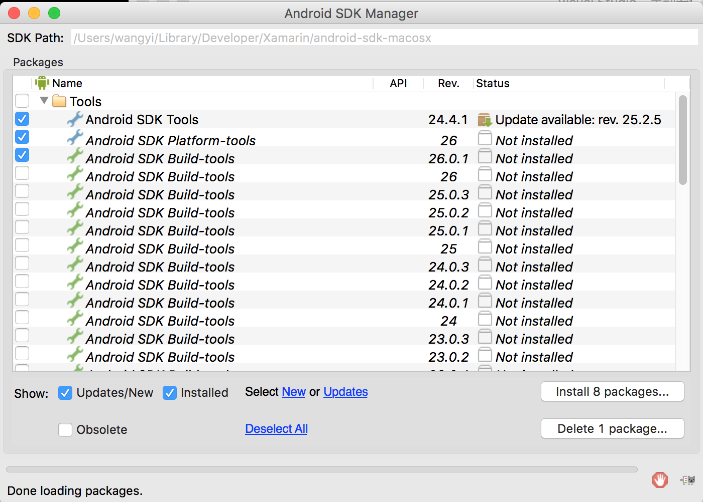

确定后，MANAGER会再次确认，要求用户接受每一个软件的安装协议。点击INSTALL按钮。

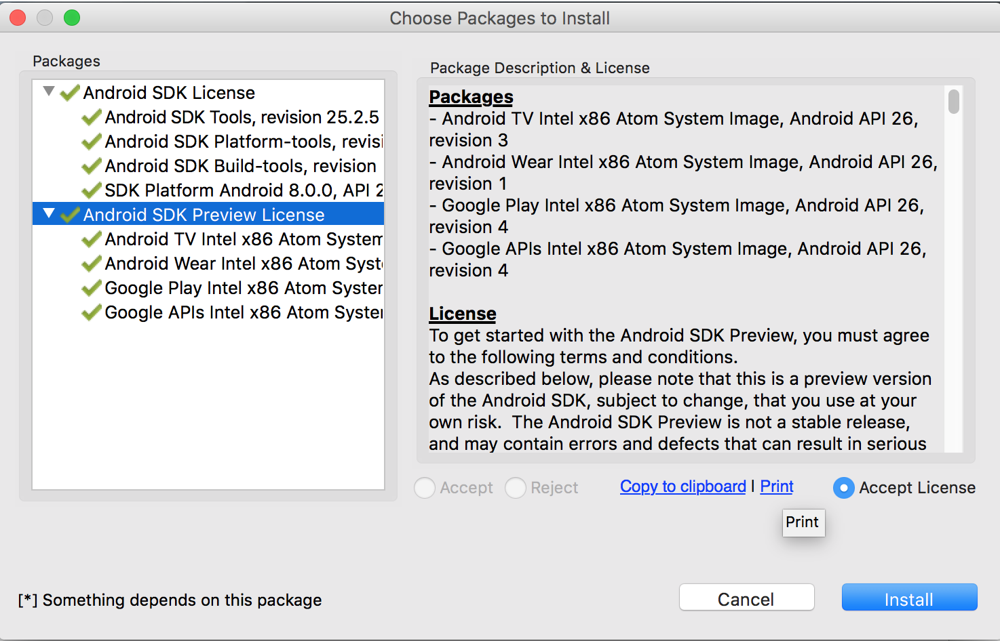

好了，ANDROID SDK搞定了。

### 其他组件的安装

VS for MAC，XAMARIN的3个组件都没遇到啥问题，双击直接搞定了。

## 没出问题的组件的安装
下面的内容在这次正式版的安装过程中没出啥问题，但是留个备份供大家参考。

### 手动安装Mono Framework

首先是Mono Framework 4.8.0.459，大概346M，下载地址见[这里](https://dl.xamarin.com/MonoFrameworkMDK/Macx86/MonoFramework-MDK-4.8.0.459.macos10.xamarin.universal.pkg)，pkg的安装包，下了5-6分钟吧，直接双击安装。


安装过程，相比.NetCore，那是相当顺利啊。

### 如何手动安装Java SDK

打开iterm，输入`javac -version`

提示

``` accesslog
No Java runtime present, requesting install.
```

点弹出窗口上的`更多信息`，然后直接跳转到了SUN的官网下载[页面](http://www.oracle.com/technetwork/java/javase/downloads/index.html)

## 未来指引

[很多的实例](https://github.com/xamarin)，慢慢学起来。

## 参考文章

1. [Visual Studio 2017 for Mac](https://www.visualstudio.com/en-us/news/releasenotes/vs2017-mac-relnotes)