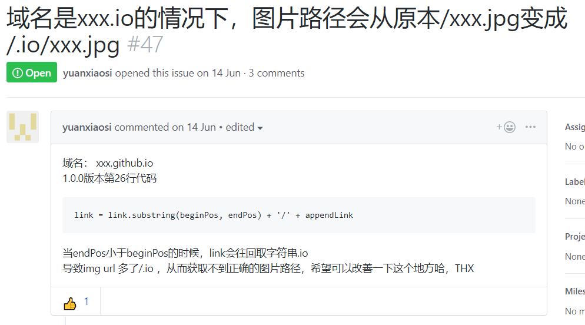

## 为什么会有这篇文章

hexo的插入图片的方式，主要有两种，一种是使用``，一种是``。

如果有人和我一样，按照下面几种方式来使用hexo，会觉得上面这两种方式，很难说哪里方式更加反人类。不问为什么，只说怎么干，就是耍流氓。我的前提条件：

1. 使用资源文件，asset_folder: true
2. 在front-matter区域，使用了urlname变量，作为生成html后的网址来存放真实文章的index.html和所有相关图片。
3. 真正markdown文章保存在`日期时间-中文件名.md`这样的文件中，并且配套生成`日期时间-中文件名`的文件夹中。
4. 我使用typora所见即所得的编辑器来写东西。typora支持拖放文件直接可视化。

这样，写文章的时候，就会很纠结，我个人是肯定受不了``的不符合MARKDOWN语法或者风格插入方式的，并且这种方式，在typora里面也看不到实际的图片。

所以，就只剩下了如何修改``这种方式了。

然后，发现了`hexo-asset-image`这个插件，好用的很。

不过大家注意，如果直接使用`npm install hexo-asset-image --save`这样安装的话，好像版本不是最新的，所以我去了作者的github上看了，果然有人在讨论这个问题，所以采用了原始保守的方式安装。

``` bash
npm install https://github.com/xcodebuild/hexo-asset-image --save
```

虽然可能网络不是很好的话，从github时间会花的长一些，但是从这里安装的，能保证是最新的版本（我当时默认方式安装的是0.0.4版本，从github安装的是0.0.5版本）。

这样安装好之后，其实还是能发现有一些小问题的，就是关于如果在_config.yml文件中没有使用超过 年/月/日 在你的title前面的话，就会有这种问题出现，我截图一下。



我是不想和这个问题过多纠缠了，我把我的permilink从以前的#permalink: post/:urlname/，改成了permalink: :year/:month/:day/:urlname/。一切完美。

这样，在typora里，我新加入的图片也可以启动显示，以前老的文章里，生成的html的一切正常，只是需要在typora里面，增加一个前置路径，这样在typora里面才能实时看到图片，总之，是比较完美的解决方案了。

## 参考链接

1. [hexo-asset-image的GITHUB](https://github.com/xcodebuild/hexo-asset-image)
2. [Hexo 的 markdown-it 渲染引擎和其相关插件](http://baishusama.github.io/2016/12/24/hexo-render-markdown-it-and-its-plugins/)
3. [在 hexo 中无痛使用本地图片](https://cloud.tencent.com/developer/article/1019861)
4. [Front-matter](https://hexo.io/zh-cn/docs/front-matter)
5. [[Hexo - Layout](https://epsi-rns.gitlab.io/ssg/2019/05/04/hexo-layout/)](https://epsi-rns.gitlab.io/ssg/2019/05/04/hexo-layout/)
6. [从零开始制作 Hexo 主题](https://www.ahonn.me/post/33)
7. [hexo中完美插入本地图片]([http://etrd.org/2017/01/23/hexo%E4%B8%AD%E5%AE%8C%E7%BE%8E%E6%8F%92%E5%85%A5%E6%9C%AC%E5%9C%B0%E5%9B%BE%E7%89%87/](http://etrd.org/2017/01/23/hexo中完美插入本地图片/))
8. [hexo图片快捷插入(https://blog.csdn.net/Jesounao/article/details/79205774)
