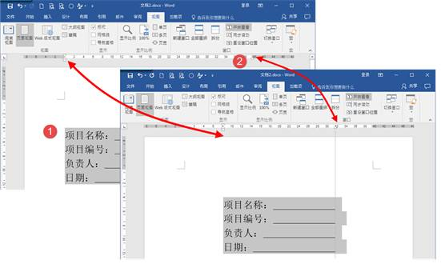
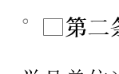

## 为什么会有这篇文章

将平时收集的各种WORD技巧汇集到一起。

## 前置条件

你有WORD就好。

### 技巧1-Word上下行不同字数等宽对齐

不说话，先看图，什么叫做没有对比就没有伤害：我们自己制作的Word封面是这样的：

大神的Word封面是这样的：

看完这两张图，还需要过多的解释吗？为了达到下图这种效果，有的小伙伴会使用空格进行调整，但有时候即使使用空格，也无法很好的对齐。

那么如何快速实现从图一到图二的呢？分享一个完美的解决方法。

首先调出标尺工具：勾选【视图】选项卡中【显示】组中的【标尺】工具。

选中需要对齐的行，移动标尺两端的标尺点到所需要的位置。
标尺在移动的过程中会有一条虚线，可以方便用户使用。

上述操作完成了对页面文字的居中和右边下划线的对齐，接下来我们需要将左边的文字以冒号为基准对齐。

选中左边的文字（注意只选择需要对齐的文字，不要选择一整行），点击【开始】选项卡中【段落】组中的【分散对齐】按钮（不能点击段落--缩进和间距--常规对齐方式中选择分散对齐），会弹出调整宽度对话框。

在弹出的【调整宽度】对话框中，根据实际需求设置【新文字宽度】，然后点击确定。

同理，设置下一行文字进行设置，就达到我们需要的效果了。

### 技巧2 查找与替换

#### 空行替换

这里的`空行`指单独显示软回车或硬回车的行。如何替换？在“编辑”菜单中打开“查找和替换”对话框（或按`ctrl+H`），在“查找内容”中输入`^p^p`（ `^p`指段落标记）替换位置中输入`^p`，然后点击`全部替换`。

#### 手动换行符(`Shift+回车`)替换

`^p^p`替换成`^p`并不能替换因`手动换行符`形成的空行。如果文件中用的是`手动换行符`，那么就要用`^l^l`替换成`^p`。

***注意，这里用的不是`1`，而是`L字母`的小写，也可以直接用替换对话框里的`特殊字符`，里面有`手动换行符`)，空行才能去除。

注意空格的存在。如果每个空行的换行符前还有一个空格。空格成了“罪魁祸首”！再用“^l ^l”(注意两个换行之间有一个空格)，替换成“^l”。单击几次全部替换，再更改了几次“查找内容”，比如把“^p ^l”替换成“^l”。页面中再也没有空行了。

查找替换：（根据回车形式不同而不同）

1、查找输入^l,替换成^p （手动回车）

2、查找^p^w^p,替换成^p （两空行之间有空格内容）

3、查找^p^p,替换成^p （如果一次没有清理干净，多查找替换几遍）

#### 软回车替换成硬回车

1.在“查找替换”中用“^l ”替换成“^p”，这里用的不是1，而是L字母的小写，也可以直接用替换对话框里的“特殊字符”，里面有“手动换行符”。

2.网上复制的内容先粘贴到“记事本”中，再复制粘贴到WORDK中，就“OK”了！

#### 一个奇怪的方框

这个方块，是一个全角空格。前面那个原点，是一个“不间断空格”，这些在特殊符号里，都可以找到。很多时候，WORD这些奇奇怪怪的符号会让你很抓狂。

## 参考链接

1. [技巧1原文参考链接](http://www.360doc.com/content/16/1010/15/2625870_597358540.shtml)
2. [参考链接](http://www.wuliaole.com)
3. [参考链接](http://www.wuliaole.com)
