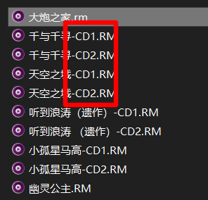
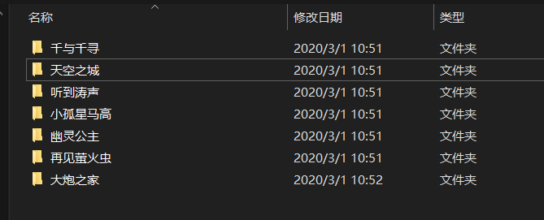
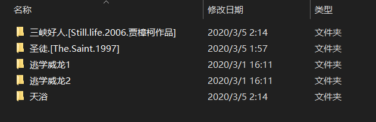

## 为什么会有这篇文章

## 前置条件
TMM有英文版，里面没有中文选项，所以这里推荐一个汉化版本，地址在[这里](http://www.3h3.com/soft/167296.html)。

## 正文

最近在用TinyMediaManager整理电影，实际过程中发现了一些小问题，网上也没有直接说，这里整理一下，方便其他用户踩坑。

### 关于刮削加速

方法步骤：
`C:\Windows\System32\drivers\etc`中的 `hosts` 文件，选择记事本打开，在最后加上

```
13.224.161.90 api.themoviedb.org
```

保存，重新打开TMM即可。如果使用记事本的话，需要启用“管理员”权限，否则文件是无法保存的。

### 关于文件标题修改

#### 剧集

经过一段时间的摸索，总结了剧集文件的命名方式，试验过几部电视剧，都能自动匹配信息，当然也许不会100%的成功自动匹配。

```
文件命名方式：影片中文名.[英文名.年份.季.格式信息]
```
例：非自然死亡.[UNNATURAL.2018.S01]

注：其中所有标点符号均为英文的标点；影片英文名单词用“.”隔开；“[]”内除了英文名和年份是必须，其他都可以删除。

#### 电影

电影的命名就更宽泛一些，感觉差不多都能匹配出来。

文件命名方式：影片中文名.英文名.年份

例子：
```
5.Centimeters.Per.Second.2007.Bluray.Remux.1080p.AVC.DTS-BYRHD
盗梦空间.Inception.2010.BluRay.2160p.x265.10bit.4Audio.mUHD-FRDS
```
注：其中所有标点符号均为英文的标点；影片英文名单词用“.”隔开；除了影片名和年份是必须，其他都可以删除。

另外，对于有一些用户和我一样，会有早期的电影，是RMVB或者RM的，一个电影分成CD1 CD2 CD3甚至是 A B C三四个文件的，这种文件，需要修改成下面这样的文件名后缀才可以被TMM成功识别。



除了上面这样的文件名修改，还要把每个电影，放到单独的一个文件夹里面，最后变成下面的样子。


### 不知道是不是BUG
我有几个电影，无论无何都无法被TMM发现，不知道是什么原因。

## 参考链接

1. [手把手教您用tMM刮削影片信息，让KODI、Jellyfin、PLEX、使用本地媒体电影墙！](https://post.smzdm.com/p/a4wkqw37/)
2. [参考链接](http://www.wuliaole.com)
3. [参考链接](http://www.wuliaole.com)
