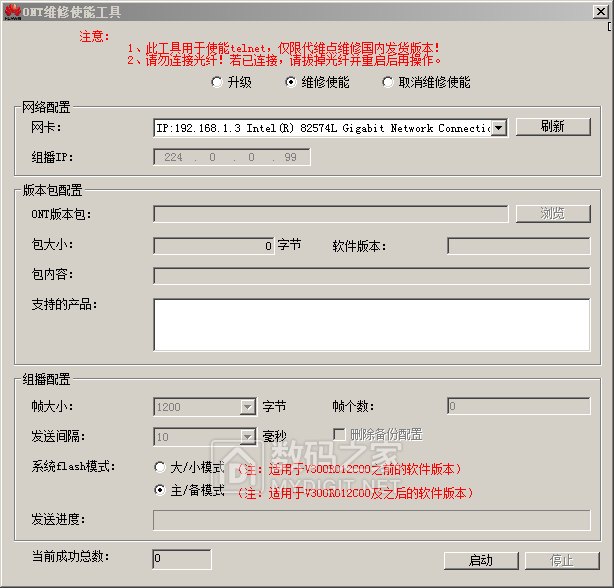
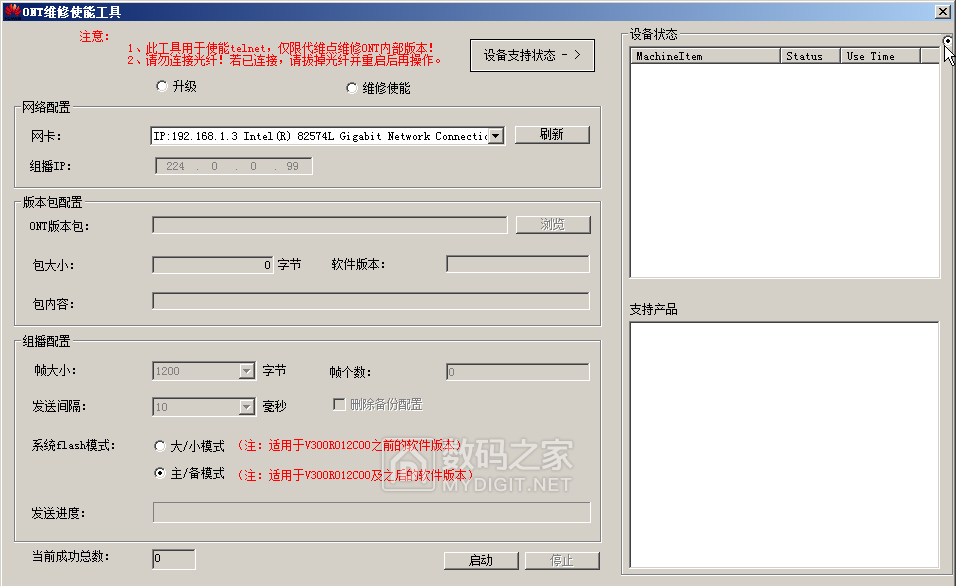
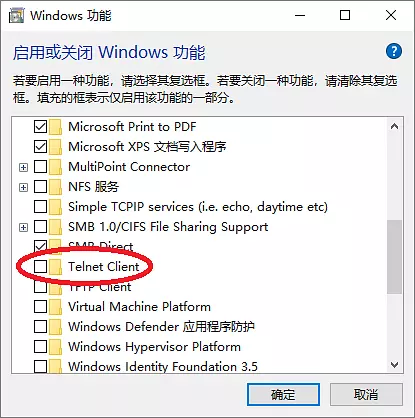
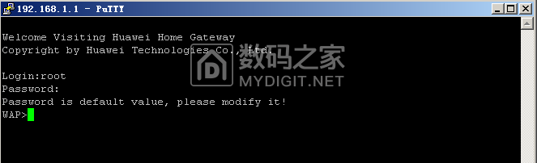
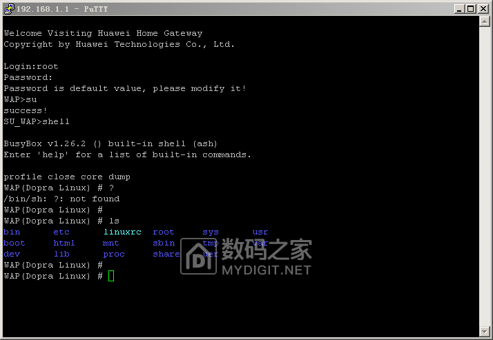
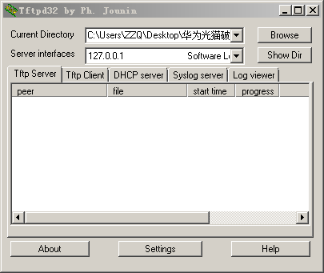
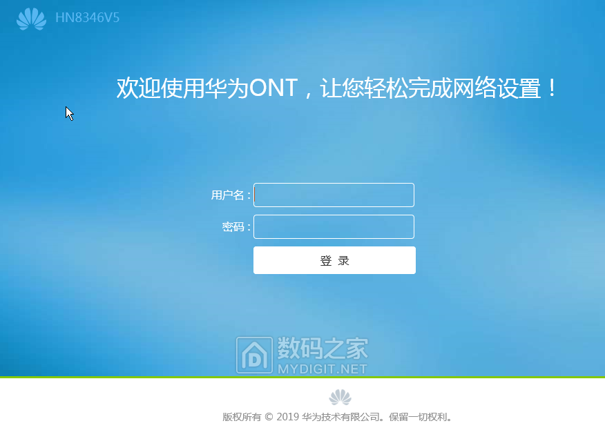

# 为什么会有这篇文章

和室友搬来了新租的房子，最近几天开始想弄一个饥荒的独立服务器，发现没有外网IP地址，遂开始在家里的光猫上面打起了主意。之前在另外一处租赁地点的时候，用的是北京联通500M的宽带，那会联通送的是烽火的200M光猫，当时也是自己折腾了半天，那会更夸张，还自己买了个华为的光猫，替换掉了烽火的光猫。刚才拍了下光猫后面的铭牌信息，发现是10GPON（非对称），所以看来应该是可以达到性能，所以，先破解，桥接了再说。

# 准备工作

北京这两年开始逐步普通1000M的光纤宽带入户，这次自己的房子里也是给的北京联通定制的华为光猫，型号为HG8346V5，光猫默认为路由模式，虽然光猫背后标注了用户名和密码，但是只是普通权限用户，里面的设置就是供你看看，想加点常用的诸如端口映射、开UPnP等都是不行，所以破解是必须的。

## 北京联通华为HG8346V5固件基本的情况

固件版本为 V5R019C30S020，硬件版本1960A

## 需要准备的软件

1. 华为光猫ONT维修使能工具，用于开设备端口telnet功能；

2. 华为光猫ONT组播配置工具，用于补全设备的Shell命令

3. tftpd32.exe，用于备份配置文件；

4. putty.exe，用户远程登陆设备；非必须，使用Windows10自带的telenet功能也可以；

5. 华为配置文件解密和加密工具，这个工具可以在Windows下对华为hw_ctree.xml进行处理，可以解密解压缩成为明码的形式，同时也可以加密压缩还原为原始的形式。相当于华为光猫中的 aescrypt2 命令。

# 破解步骤

## 1、使用华为光猫ONT维修使能工具打开Telnet功能

选择维修使能，点击启动，此时光猫所有指示灯闪烁，等到所有指示灯灭后，点击停止按钮，关闭工具程序，重新启动光猫。

## 2、使用华为光猫ONT组播配置工具补全设备shell命令

注意选择右上角那个点，点击启动，此时光猫所有指示灯闪烁，等到所有指示灯一直亮后，点击停止按钮，关闭工具程序，重新启动光猫。

### 3、备份设备配置文件

#### 方法1 使用telnet

现在就可以通过telnet命令来访问路由器了。如果你使用windows系统，而且没有安装telnet客户端，可以通过“`控制面板`”-“`启用或关闭windws功能`”，勾选“`Telnet Client`”来进行安装。

然后打开cmd命令行，输入telnet root@192.168.0.1，然后输入密码（输入时候看不到，正常）

#### 方法2 使用putty

通过putty进入Telnet后（用户名:root 密码：adminHW）	

#### 继续

无论上面哪种方法，进入shell后，输入su命令，输入shell回车 ，输入ls回车，看是否能看到路径

进入目录/mnt/jffs2，复制原配置文件hw_ctree.xml到myconf.xml.gz中

输入**cp hw_ctree.xml myconfig.xml.gz** 回车

这个文件是AES加密的，所以先解密，

输入**aescrypt2 1 myconfig.xml.gz tmp**回车

解密后的文件还是被压缩了的，所以要用gunzip命令展开压缩文件myconf.xml.gz，得到myconfig.xml。

输入**gunzip myconfig.xml.gz**回车

把生成的xml用tftp32传回来

先打开tftp32.exe

然后输入**tftp -p -l myconfig.xml -r myconfig.xml 你机器的IP**

## 4、恢复华为登录界面

输入restorehwmode.sh 命令回车，光猫将恢复为华为界面。看到提示successful后，重启光猫,就会转为华为原厂界面。光猫的IP变为192.168.100.1 超级账户名：telecomadmin,密码：admintelecom。SSID: WirelessNET 密码:eeeeeeee

## 5、重新启动光猫

重启光猫后，登录192.168.100.1，会发现界面已经恢复为华为登录界面，并且有**telecomadmin**超级用户权限，登录进去以后，使用配置文件导入功能将上面生成的**myconfig.xml**配置文件导入即可。光猫重新启动后，以前的所有设置全部恢复回来了。

恢复到华为界面后功能强大（同时比联通界面下超级管理员的功能还多一些）。路由和桥接可以自由选择。

# 其他办法

可以去淘宝上花50元左右，请人远程操作，这种方法是最为简单的方法；还有就是电话保修，直接说自己希望光猫转桥接，小哥连门都不用上，10分钟左右就能搞定，记得给人家一个好评即可。

# 参考链接

1. [北京联通光猫华为HN8346V5破解方法介绍](https://www.mydigit.cn/forum.php?mod=viewthread&tid=118165)
2. [破解华为光猫（ONT）的设备连接数限制](https://github.com/tabris17/Crack-Huawei-ONT/blob/88f873774ca3f0a2a7ac9ee3d8c656d63c89be73/README.md)
3. [参考链接](http://www.wuliaole.com)
