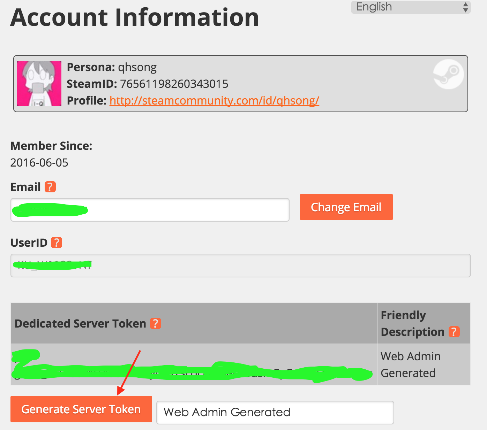
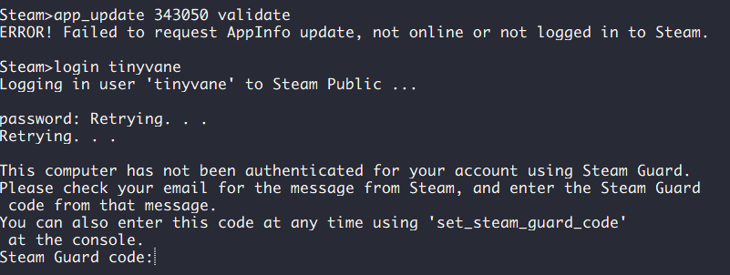
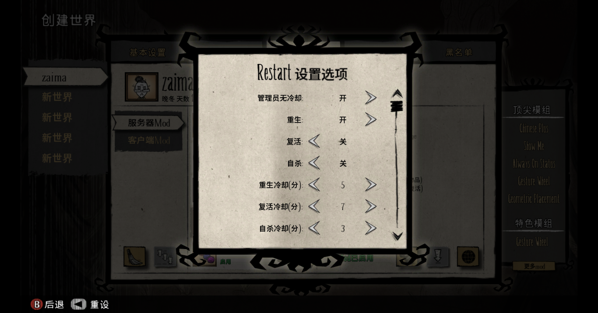

# 为什么会有这篇文章

就在3天之前，我成功的使用群晖+外网IP+8G内存，搭建了一个可以让外网用户访问的DST服务器（饥荒，Don't Starve Together Dedicted Server），但是仅仅过了2个晚上，网络卡顿的问题就从游戏小伙伴那边反应过来了。不可否认，家用网络即便是北京联通的千兆光纤（下行1000M，上行50M估记），网络的稳定性也不能和阿里云、腾讯云、华为云等公有云相提并论。

所以，赶紧去阿里云首页上看看促销，发现服务器2核心、4G内存、5M外网带宽的服务器，新人购买仅仅需要971元，这和我三年前2M带宽的价格竟然一样，很开心，然后又跑去淘宝一看，哇塞，还能9折。走起！当天婉上就付款，一气呵成把服务器搭建完成。

然而，搭建游戏并做好管理员，实在很难，并且一路是坑。‘

另外下面的记录，全部是没有出问题的顺利步骤，错误统一在文章最后，可以使用CTRL+F或者/命令对照错误提示i信息。

# 更新记录

1. 20200315-首次成文。

# 必备条件

1. 环境环境：公网（比如阿里云、腾讯云等）或者私有云（比如我之前的联通外网IP的方式）；
2. 硬件环境：私人服务器、电脑、公有云计算环境（如阿里云的ECS）均可；个人经验，我的服务器5M带宽+2核CPU（具体型号XEON之类的）可以撑起来15-16个人，CPU保持95-95%的利用率，所以感觉CPU才是重点，人物、物品多的时候，计算量是个更重要的负担；
3. 系统环境：这里使用的是CentOS系统搭建的，也可以使用Windows环境搭建（我至今没写过记录），均可；
4. 知识储备：无论使用Win或CentOS（Centos、Ubentu等甚至国产麒麟系统，都是Linux的发行版，内核是相似的），都需要对文件操作、系统权限等知识有一些准备，否则过程可能会稍微曲折。
# 步骤套用前提
1. CentOS 64位，7.2版本，其他版本的系统可以稍微修改下即可使用

# 感谢前人的工作

1. [阿里云/腾讯云搭建饥荒服务器](https://heroydx.github.io/2018/07/31/dst-00/)，使用Ubuntu的朋友，可以参考这篇文章里面的脚本，区别和CentOS也不大。
2. [CentOS下安装和配置饥荒联机版服务器](https://sumygg.com/2016/01/24/install-and-configure-dont-starve-together-server-on-centos/)
3. https://sumygg.com/2016/01/24/install-and-configure-dont-starve-together-server-on-centos/
4. [在Centos7.3下开设一个饥荒服务器](https://sqh.me/tech/build-dont-starve-together-server-on-centos/)，作者做了一个安装的脚本。
5. [CentOS下安装和配置饥荒联机版服务器](https://sumygg.com/2016/01/24/install-and-configure-dont-starve-together-server-on-centos/)
6. [饥荒联机版独立服务器搭建踩坑记录](https://printempw.github.io/deploy-dont-starve-together-dedicated-server/)，Ubuntu服务器指南。
7. [饥荒联机独立服务器搭建教程（三）：配置篇](blog.ttionya.com/article-1235.html)
8. [123](http://123)
9. [123](http://123)
10. [123](http://123)
11. [123](http://123)

# 操作步骤
## 1. TOKEN的准备

### 1.1 申请DST独立服务器TOKEN

登录Steam，进入DST游戏，然后点账号，点饥荒游戏，如果是中文版，可以看到一个黄色按钮，写着“饥荒独立服务器”，点申请TOKEN，复制下来。

### 1.2 写入cluster_token.txt文件

`cluster_token.txt`主要用来做服务器验证。打开DST，找到Account，在打开的页面里面，选择`Generate Server Token`，这样就得到了一个token。



把这个token串儿粘贴到`~/.klei/DoNotStarveTogether/MyDediServer/cluster_token.txt`文件中。或者使用传输工具，如考虑使用`scp`命令上传

```
scp 本地路径/server_token.txt username@12.34.56.78:~/.klei/DoNotStarveTogether/
```

## 2. 服务器安装

要想安装游戏服务器，需要先安装SteamCMD工具，可以参考[SteamCMD](https://developer.valvesoftware.com/wiki/SteamCMD#Linux)、或者[SteamCMD官方安装指南](https://developer.valvesoftware.com/wiki/SteamCMD#Linux)的步骤来安装。这里简单说明一下。

### 2.1 安装SteamCMD

安装依赖（针对 CentOS 64位）

```
yum install glibc.i686 libstdc++.i686
```

添加用户并切换到steam用户

```
useradd -m steam
su - steam
```

创建steam文件夹

```
mkdir ~/steamcmd
cd ~/steamcmd
```

下载SteamCMD

```
wget https://steamcdn-a.akamaihd.net/client/installer/steamcmd_linux.tar.gz
```

解压

```
tar -xvzf steamcmd_linux.tar.gz
```

### 2.2 下载饥荒服务器

解压完成后就可以使用了，下面通过steamcmd下载饥荒的服务器。

运行steamcmd（请在steam用户下操作）

```
cd ~/steamcmd
./steamcmd.sh
```

第一次运行需要初始化和更新，当出现 `Steam>` 提示符的时候就可以输入命令了。

下载饥荒服务器程序

```
app_update 343050 validate
```

一般会遇到下面的错误

``` bash
ERROR! Failed to request AppInfo update, not online or not 
logged in to Steam.
```

再加个截图



这是因为每个游戏的下载条件不同，有的游戏允许匿名下载，而DST是必须要登录才能下载安装程序的。

使用账号登陆

```
steam>login your_user_name #这里输入你的账号名
```

输入密码（不会显示），然后如果你的Steam账号开启了两步验证，还需要继续输入你的验证码

```
Steam>app_update 343050 validate
 Update state (0x61) downloading, progress: 99.97 (575640569 / 575805881)
 Update state (0x61) downloading, progress: 99.97 (575640569 / 575805881)
Success! App '343050' fully installed.

Steam>quit
```

这一步可能比较慢，耐心等待一下，网络中断的话就重新下载一次。这里的`343050`是饥荒游戏的ID，如果要下载其它游戏，只需改成其它游戏的ID即可。

## 3. 服务器配置

先贴一下`~/.klei`的目录结构：

```
[steam@blabla ~]$ tree .klei
.klei
└── DoNotStarveTogether
    ├── Cluster_1
    │   ├── adminlist.txt
    │   ├── Caves
    │   │   ├── backup
    │   │   │   ├── server_chat_log
    │   │   │   └── server_log
    │   │   ├── modoverrides.lua
    │   │   ├── save
    │   │   │   ├── boot_modindex
    │   │   │   ├── client_temp
    │   │   │   ├── event_match_stats
    │   │   │   ├── mod_config_data
    │   │   │   ├── modindex
    │   │   │   ├── profile
    │   │   │   ├── saveindex
    │   │   │   ├── server_temp
    │   │   │   │   └── server_save
    │   │   │   └── session
    │   │   ├── server_chat_log.txt
    │   │   ├── server.ini
    │   │   ├── server_log.txt
    │   │   └── worldgenoverride.lua
    │   ├── cluster.ini
    │   ├── cluster_token.txt
    └── startgame.sh（我自己写的游戏启动脚本）
```

上面Caves只是一个shard世界，我还有其它几个，目录太长就省略了，文件和目录结构和Caves是一致的。

下面是`~/Steam`的目录结构

```
[steam@blabla ~]$ tree
.
├── log
├── Steam
│   ├── steamapps
│   │   ├── appmanifest_343050.acf
│   │   ├── common
│   │   │   └── Don't\ Starve\ Together\ Dedicated\ Server
│   │   │       ├── bin
│   │   │       │   ├── dontstarve
│   │   │       │   ├── dontstarve_dedicated_server_nullrenderer
│   │   │       ├── mods
│   │   │       │   │   ├── modinfo.lua
│   │   │       │   │   ├── modmain.lua
│   │   │       │   ├── workshop-xxxx
│   │   │       └── version.txt
│   │   ├── downloading
│   │   ├── libraryfolders.vdf
│   │   ├── shadercache
│   │   └── temp
│   ├── steamcmd_linux.tar.gz(steamcmd的下载文件，位置无所谓)
│   └── steamcmd.sh
```


游戏默认会被下载到 `/home/steam/Steam/steamapps/commom` ，可以去此目录找到下载的游戏文件。

进入饥荒游戏的`bin`目录，运行

```
./dontstarve_dedicated_server_nullrenderer
```

这时候可能会显示

```
./dontstarve_dedicated_server_nullrenderer: error while loading shared libraries: libcurl-gnutls.so.4: cannot open shared object file: No such file or directory
```

在CentOS下没有这个链接库，可以用其它的库代替一下

```
ln -s /usr/lib/libcurl.so.4 /usr/lib/libcurl-gnutls.so.4 && ldconfig
```

*** 另外也可以使用 `ldd ./dontstarve_dedicated_server_nullrenderer` 来查看程序缺少的动态链接库。

这时候再运行就不报错了，接下来就会出现以下信息

```
[200] Account Failed (6): "E_INVALID_TOKEN"
!!!!!!!!!!!!!!!!!!!!!!!!!!!!!!!!!!!!
!!!! Your Server Will Not Start !!!!
!!!!!!!!!!!!!!!!!!!!!!!!!!!!!!!!!!!!
No auth token could be found.
To generate a server_token you must
open the console from a logged-in game
client with the tilda key (~) and type:
TheNet:GenerateServerToken()
This will create 'server_token.txt' in
your client settings directory. Copy this
into your server settings directory.
```

提示缺少server token，准备工作的时候已经准备了server_token.txt，确保`/.klei/DoNotStarveTogether/`目录下存在正确的server_token.txt就可以了。

另外一个需要配置的文件是server.ini文件，参考以下模板将配置文件修改一下，由于饥荒不支持Unicode字符，所以做好不要使用中文。下面的（）里面的文字都是说明文件，要删掉）

注意：有很多网上的教程，依然使用的是老版本的server.ini的设置，比如[network]区域的default_server_name、default_server_description、server_password、server_port，[STEAM]区域的DISABLECLOUD等选项（不一一例举）已经被放弃使用，大家需要十分注意，不要错用了老版本的格式。

具体的server.ini文件，详见**4. 多层时间**。

之后运行服务器就会生成一个默认的世界了。

这时候去http://my.jacklul.com/dstservers看一看服务器列表上有没有你的服务器，或者进入DST游戏，浏览游戏看看谁能是否自己能看到你刚建立的游戏。

## 4. 多层世界

### 4.1 多层世界的概念

网上很多的教程都是采用的默认配置，即Cluster_1下面一个Master一个Caves，也就是通常一个地上世界（overworld）搭配一个地穴世界（cave），因为最近几天研究了半天，终于搞明白Klei的策略和想法。

所以一个Master，一个Cave也算是多层，就是层不多，2个而已。

一个cluster（簇），是一个服务器节点，一个Master或者Cave是一个shard（片），这个shard对一个cluster来说，也是一个server，这个容易混乱，继续看下去就好了。cluster下面可以包含无数个shard server，只要你的服务器性能足够牛。

但是，我想说的是但是，一个Cluster也可以不用非要运行在一台物理服务器上，还是那句话，你服务器性能足够好的话，可以有无数个Cluster+无数个shard，但是这样管理上就比较混乱了。

所以，推荐你一台服务器上，就放一个Cluster目录，当然这个目录名字你随便定，然后这个这个Cluster下面你可以运行多个世界，比如2个地上世界，3个地下世界，随便你。

可能有人想不明白这样的应用场景，我举个例子，你有一台群晖服务器，性能一般般，带宽一般般，只是有个公网IP你不想浪费，搭建了一个游戏服务器，但是玩家进来有点卡，那用来做什么呢？可以做仓库！我就发现了有人开仓库氪金，开一个仓库世界40块钱一年。同时，你用另外一个性能较好的云服务器做主世界，主世界的人可以跳到群晖世界存取物品，卡一点也无所谓。

这样就变成了两个Cluster，一个群晖Cluaster，一个公有云Cluster。两个server.ini文件。

好了，下面会讲到server.ini和cluster.ini，也是开多层世界的重点。

### 4.2 cluster.ini文件

刚才没有讲解完server.ini文件，继续看下面的详细讲解，重点关注shard篇章。

下面是标准的server.ini文件。英文版介绍见[这里](https://forums.kleientertainment.com/forums/topic/64552-dedicated-server-settings-guide/)。

```
[network]
cluster_name = Your unique server name （最新版支持中文）
cluster_description = A very nice server description （最新版支持中文）
cluster_password = password （如果设置，则进入游戏需要输入密码）
offline_cluster = false
lan_only_cluster = false
whitelist_slots = 1（保留的位置数，在whitelist.txt中文件中一行一个写如用KU的用户名）
cluster_intention = social（游戏模式，无穷无尽、生存、野外生存？）
autosaver_enabled = true（是否自动保存游戏进度，建议开启，方便回滚游戏档案）
tick_rate = 30（服务器和玩家的交互次数，15、30、60，默认15，如果服务器很牛逼，可以用60，增加游戏平滑体验）

[GAMEPLAY]
game_mode = endless
max_players = 64（最大玩家数量，你写200也没事，个人经验5M带宽2核CPU最多支持15-16个玩家，再多就开始卡得厉害）
pvp = false（是否开启玩家对战，随便）
pause_when_empty = true（是否在世界没人时候停止时间，建议true）
vote_kick_enabled = true

[STEAM]
steam_group_only = false（默认false，如果修改为true，则该cluster server仅允许steam_group_id中的账号登录）
steam_group_id = 0（默认为0，否则就是steam group的id，具体设置可以自己网上搜索，我没有用到）
steam_group_admins = false（默认false，如果为true，则steam group的管理员，也可以在游戏中拥有管理权限）

[MISC]
console_enabled = true（允许在~菜单中使用lua命令）
max_snapshots = 6（最大快照保存数量，用来在游戏中回退到过往游戏的存档记录）

[SHARD]
shard_enabled = true（如果除了Master你还有其他世界，需要选择true）
bind_ip = 127.0.0.1（如果shard_enabled = true，并且is_master = true，则生效。多个shard都在一个Cluster下面，这里写默认值是127.0.0.1，如果你的shard分布多于一台物理服务器，需要设置为0.0.0.0。且如果每个shard都可以通过server.ini单独设置并且覆盖cluster.ini的设置）
master_ip = 127.0.0.1（如果所有的shard都在同一台物理服务器上，写默认值127.0.0.1。如果不是这种情况，则填写非master shard所在的物理服务器的IP地址。）
master_port = 10998 （默认值10888。主服务器监听的UDP端口，方便其他shared接入。该值可以被Master shard目录下的server.ini覆盖。如果有其它的shard接入，每个shard/server.ini下的该值都必须不同，方可通信）
cluster_key = MsAhBAXhhnElO5IPKr4G（密钥，防止其他人链接到你的Cluster服务器）
```

### 4.3 server.ini文件

然后该说shard目录下的server.ini文件了。先上典型配置。

```
[SHARD]

is_master = true | false（默认是不存在这个选项的，如果需要生效，需要cluster.ini中的shard_enabled = true。这个选项主要是说明当前shard是否为master shard，每个游戏server，如果多个shard，master shard目录的该选项必须为true，其他shard目录下的必须为false。

name = （默认为空，若需要生效，则需要在cluster.ini中设置shard_enabled = true且is_master = false。这个名字主要用于日志文件中，以区分不同的shard的行为。master shard设置了也没用，默认为[SHDMASTER]）

id = （默认为随机生成的数字，字符串类型。该之值和name相似，也只对非master shard生效，用于区分每一个不同德世界，生成地图之后，再次修改这个值将引起严重的问题，有多严重，我后文中写了。）

[STEAM]

authentication_port = （默认8766，是steam的内部端口号，UDP类型，必须打开，每个shard需要不同。）
master_server_port = （默认27016，是steam的内部端口号，UDP类型，必须打开，每个shard需要不同。）

[NETWORK]

server_port = （默认10999，UDP类型，且值域范围是10998 and 11018。每个shard必须不同。这样的规定限制了同一个Cluster目录下的shard的个数，我算了算是21个。但是和网上的一些服务器搭建大神交流后，实际是这个数值并没有11018的限制，可以继续增加）。
```


还记得上面使用的`./dontstarve_dedicated_server_nullrenderer`命令启动游戏么？其实这个命令后面可以接很多参数，花里胡哨的我就不说了，只说常用的重点参数

```
-console
-Cluster clusterName
-Shard shardName
```

文件的默认版本，我已经上传到了网上。cluster.ini、server.ini、[worldgenoverride.lua（地上世界）](http://pastebin.com/raw/7zepC7x5)和[worldgenoverride.lua（地下世界）](http://pastebin.com/raw/jsSptdMQ)。

## 5. 关于传送门

这个东西，目前其实很少有人研究了，每个世界地图，默认10个传送门，如果你有2个世界，就是20个传送门，这些传送门之间都是可以手动规定跳转的位置的。具体可以参考这个[文章](https://forums.kleientertainment.com/profile/773547-nuke1/)。

# MOD安装

mod可以为服务器生存增加便利性和可玩性。加入mod的服务器无法通过直连方式（`c_connect`命令）连接了，需要通过在线列表搜索进入。

首先，需要先从创意工坊里下载mod，修改`dedicated_server_mods_setup.lua`文件可以让服务器每次启动的时候自动加载和更新mod，该文件位于`/home/steam/Steam/steamapps/common/Don't Starve Together Dedicated Server/mods` 文件夹。向下面这样添加，数字为创意工坊中mod的编号。

```
ServerModSetup("345692228")
ServerModSetup("346968521")
ServerModSetup("352373173")
ServerModCollectionSetup("379114180")
```

下载mod之后服务器不会自动加载，需要继续配置要加载的mod，这里有3种方法。

### 方法1

第一种方法修改`modsettings.lua`文件强制加载mod，这个文件在`mods`文件夹下可以找到。使用这种方法加载的mod会以默认配置启动，而且无法修改配置，无法在多服务端下隔离配置。

```
ForceEnableMod("workshop-345692228")
ForceEnableMod("workshop-346968521")
ForceEnableMod("workshop-352373173")
```

### 方法2

方法修改`modoverrides.lua`文件返回mod信息进行加载。该文件在`/home/.klei/DoNotStarveTogether`文件夹下。这种方法可以隔离不同服务端的配置，而且可以根据需要修改mod的配置。推荐以这种方式加载mod。

```
return {
    ["workshop-371920345"] = { enabled = true },
    ["workshop-347079953"] = { enabled = true },
    ["workshop-458940297"] = { enabled = true },
    ["workshop-378160973"] = { enabled = true },
    ["workshop-375859599"] = { enabled = true },

    ["workshop-361336115"] = { enabled = true,
        configuration_options =
        {
            hunt_time = 6,
            ["String Phrase Option Name"] = "some value",
        }
    },
}
```

### 方法3：

上面两种方法相对来说，都比较麻烦，所以我们可以用一些取巧的办法完成 Mod 的配置。



首先我们去 Steam 客户端里打开饥荒联机版的游戏，然后创建一个世界，把那些「你想要在服务器里启用的 Mod」都给启用了，并且直接在游戏的「Mod 配置」页面里配置好（有可视化界面，配置很方便），配置完毕后进入世界再退掉。这时候进去你的存档位置（比如：`Documents\Klei\DoNotStarveTogether\Cluster_3\Master`），把你本地的 `modoverrides.lua` 文件内容上传到服务器里就好了。

如果担心修改乱了，下面是默认的地图LUA文件设定。

[Overworld](http://pastebin.com/raw/7zepC7x5)、[Cave](http://pastebin.com/raw/jsSptdMQ)

# 启动脚本

可以创建一个启动脚本来启动。

```
#!/bin/sh
cd /home/steam/Steam/steamapps/common/Don\'t\ Starve\ Together\ Dedicated\ Server/bin
/usr/bin/screen -S "DST" -X "master" /bin/sh -c './dontstarve_dedicated_server_nullrenderer -console -shard Caves'
```

-console是使用控制台模式运行

-shard shardname是启动名字是shardname的世界，对应的是/Cluster_1/shardame。

我是用了4个脚本，分别启动同一个服务器上的4个世界。

运行脚本之后可以使用快捷键 `Ctrl + A, D` (按住Ctrl然后依次按A和D)切换到后台，要将其切换到前台，可以输入`screen -r DST`命令。

# 设定管理员（可选）

首先，你要得到你想要设为管理员的玩家的`用户 id`。

有两种方法：

1、让该玩家加入游戏，再查看日志，你会在日志中找到 `KU_` 开头的一串`用户 id`

2、让该玩家点击游戏主页面的 `Account` 按钮（和获得 token 一样），在页面中会有`用户 id`

之后，**把`用户 id` 一行放一个，保存在 `adminlist.txt` 文件中。**下面是栗子：

```
KU_3N5kE2Zp
KU_BJY3CxYT
KU_DF1orNGA
KU_FAd2Yr8m
KU_vvbUjgIX
```

 为什么要设置管理员呢？因为管理员可以使用远程指令，比如说回滚，强行保存，踢人等等

# Ban 用户（可选）

**从日志中找到他的 `SteamID64`，添加到 `blocklist.txt` 中，一行一个。**

# 白名单席位（可选）

 `cluster.ini` 里有一个 `whitelist_slots` 配置，就是白名单席位。

白名单席位占用最大游戏人数，比如说，服务器一共开了 16 个位置，设置了 6 个白名单席位，此时，最多只能加入 10 个普通玩家。

**与 `blocklist.txt` 对应，这个文件是 `whitelist.txt`，但是里面的内容是以 `KU_` 开头的`用户 id`。**

# 控制台命令

如果是管理员的话可以在客户端使用控制台（`~`键，在1的左边）执行命令，附一些服务器常用的命令：

> TheNet:Kick(userid) 
> 	#踢出玩家
> TheNet:Ban(userid) 
> 	#禁止玩家
> c_save()>
>	#立即保存
> c_reset(true|false) 
> 	#true保存并重新加载世界，false不保存直接重新加载当前世界
> c_shutdown(true|false) 
> 	#true保存并关闭当前世界，false不保存直接关闭当前世界
> TheNet:SetAllowIncomingConnections(true|false) 
> 	#true允许他人加入，false阻止任何人加入
> c_sethealth(percent)
> 	#设置血量，括号里填百分比，0.9=90%
> c_setsanity(percent)
> 	#设置san值，括号里填百分比，0.9=90%
> c_sethunger(percent)
> 	#设置饱食度，括号里填百分比，0.9=90%
> c_godmode()
> 	#上帝模式
> c_speedmult(multiplier)
> 	#设置移动速度，一般1.2足够
> c_reset()
> 	#在不保存世界的情况下重载，会导致掉线
> c_regenerateworld()
> 	#删除当前世界并生成新世界
> c_save()
> 	#手动保存
> c_shutdown(true | false)
> 	#c_shutdown(true)或c_shutdown()保存游戏并关闭服务器，c_shutdown(false)不保存游戏直接关闭服务器
> c_rollback(count)
> 	#回档，count从1开始计算，回到之前保存的状态

# 两台服务器分别开shard

以服务器1、服务器2、shard1和shard2举例。无所谓两个shard是地上+地下，还是地上+地上，都无所谓。规定服务器1为master shard，它的server.ini文件规定了各种在游戏列表中的主体信息。

具体过程：

服务器1运行shard1，服务器2运行shard2，shard1是master，shard2是slave，主从关系。

- 修改服务器2的`cluster.ini`文件，将master_ip的值设为shard1所在服务器1的IP地址。如果shard1和shard2在同一网络中，master_ip的值也可以为内网地址。
- 在cluster.ini中，将bind_ip的值修改为0.0.0.0。
- 两台服务器的cluster_token.txt必须一致。
- 在两台机器上分别启动shard。
- 注意ECS的安全组策略，要开放指定端口。

# 错误总结

## 1、*SOCKET_PORT_ALREADY_IN_USE*

分析1：一般因为使用CTRL+C结束进程，但是端口依然占用着。

解决：建议reboot重新启动服务器。

分析2：注意Master世界和Caves世界的端口是不能冲突的。

解决：注意检查server.ini和cluster.ini中关于port的设置，不能重复。

## 2、无法在服务器游戏列表显示自己的服务器

我能做的都做了，就是无法看到服务器在游戏列表显示

分析1：可能是游戏版本问题。

解决1：注意及时更新游戏程序。

分析2：注意阿里云ECS的安全组策略

解决2：在安全策略中，将UPD端口开放。

## 3、Operation too slow

问题如下：

```
[16:37:41]: CURL ERROR: (api.steampowered.com) Operation too slow. Less than 5 bytes/sec transferred the last 30 seconds
[16:37:41]: Failed VersionCheckFileDetailsResponse
[16:37:41]: Failure error code received: 0
[16:37:41]: With Body:
```

分析：

解决：

# 坑的总结

1. 如果你用了两个shard，但是只启动了一个shard(master)的，其他用户从另外一个shard退出来了，就无法再次进入了，即使在服务器列表里可以看到你的服务器信息。
2. 如果你修改`server.ini`，然后启动游戏后，使用了`CTRL+C`结束进程，这个时候你可能会发现后面修改的`server.ini`无法起作用，原因是你的某些修改比如修改了id的名字，服务器配置会出问题，从而导致游戏使用`save/server_temp`目录下保存的数据，这个时候，你就需要把这个`server_temp`下的文件删掉，重新修改一次`server.ini`后，再次启动才能看到效果。
3. 如果你有多个shard，你从哪个shard登录出来结束游戏，如果那个shard发生了改变，那么你就无法再次登录进去游戏了，如果你自己搭建服务器，请务必注意这个问题。比如，你有3个shard，你从shard2登录出去了，然后结束掉shard2，然后你想进去游戏就不行了，但是如果你KILL掉其他的shard，还是可以进入游戏的（但是master shard绝对不行，为啥？因为这个是服务器列表里面的shard）。

# 参考链接

1. [**Dedicated Server Settings Guide**](https://forums.kleientertainment.com/forums/topic/64552-dedicated-server-settings-guide/)，官方的server.ini和cluster.ini设置指南。
2. [**Understanding Shards and Migration Portals**](https://forums.kleientertainment.com/forums/topic/59174-understanding-shards-and-migration-portals/)
3. [参考链接](http://www.wuliaole.com)
