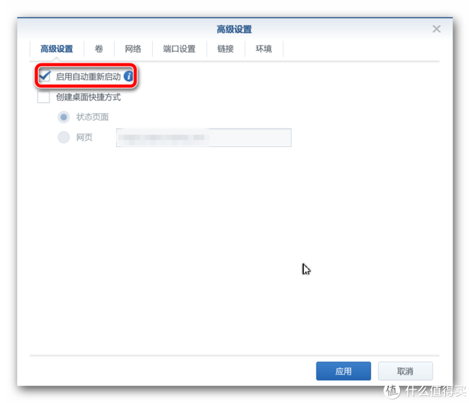

# 为什么会有这篇文章

最近在和室友玩饥荒游戏，发现Klei的游戏列表里面，很多人都是独立的服务器（dedicated server），就想自己试试搭个服务器，也省得每次都只能自己开服务器才能让室友和自己一起玩。

可能是因为自己有一台群晖的NAS，只用群晖管管照片、transmission下下电影还不够物尽其用，所以才想到用群晖吧。

# 前置条件

1. 想搭建服务器一台能让互联网上面的网友加入的饥荒服务器，首先你需要有公网的IP地址，我自己这里是北京联通的1000M的光纤网络，所以默认会送一个公网的IP地址。如果你是其他ICP，遇到没有公网IP地址的情况，可以电话保修要求客服提供一个，或者自己采用其他的方式（比如通过ngrok内网穿透之类的方式，这里不多做介绍，我自己也没用过），得到一个公网的IP地址。

2. 你需要Docker环境，这里我默认使用群晖提供的Docker功能。

# 开始前请注意的问题

1. 网上原文的步骤发表于2017年11月份，原来的很多设置有了变化，我已经挨个更新到了2020年3月10日的最新版，请仔细看下面的说明；
2. Docker中目前有2个同样受欢迎的dst，我选择的jamesits的发布作品进行的针对性设置，各位请注意。

# 从群晖Docker中下载

首先，开启Docker应用：▼


然后，在注册表中搜索：Starve，可以发现有两个不同作者发布的docker，这篇里选择了jamesits的发布作品。


双击下载，选择latest（最新）标签，点击确定。嗯，由于大局域网的原因，极有可能会下载失败，建议多试两次，总会成功的。映像大小大约为800M。


静待其下载完成，通知中心会弹出提示，此时在左侧映像栏目中选中刚刚下载的映像，点击“启动”


# 环境变量设置

下载完成后，首先需要设置一些参数变量。

在具体动手之前，请先熟悉阅读作者发布说明书，这里是最新版的[地址](https://hub.docker.com/r/jamesits/dst-server)。


由于Docker采用了虚拟化技术，一旦开始运行是无法对Docker中的文件进行直接修改的，所以需要将Docker中我们需要自行配置的路径映射到群晖文件夹中方便我们来进行修改，在这个映像当中就是Docker中的`/data`路径。

该Docker的作者给出了文件路径及网络端口部分的说明，传送门见[这里](https://github.com/Jamesits/docker-dst-server/blob/master/docker-compose.yml)。我摘录一下：

```
version: "3"
services:
  dst-server:
    image: jamesits/dst-server:latest
    deploy:
        restart_policy:
            condition: on-failure
    ports:
        - "10999-11000:10999-11000/udp"
        - "12346-12347:12346-12347/udp"
    volumes:
        - ~/.klei/DoNotStarveTogether:/data
    stop_grace_period: 6m
```

可以看到

此时会来到引导页面：


首先，为了确保群晖其他服务的正常运行，我们需要对饥荒服务进行适当限制，将内存限制在1200M。

然后，点击高级设置：

首先勾选应用自动重新启动功能，当然为了方便访问控制，也可以勾选创建桌面快捷方式。



第二步，切换到”卷“选项卡，这里就是我们刚刚在上文说到的将Docker内部文件映射到群晖文件路径的过程，在这里点击“添加文件夹”按钮，下方栏位中左侧选择的是群晖的文件夹路径，右侧为Docker文件夹中的路径，产生映射关系。


左侧文件路径点击后，系统会提示你进行选择，我选择在Docker文件夹中新建DST文件夹用以区分。

右侧路径我们填写上方在Docker说明中所看到的路径：/data/DoNotStarveTogether/


继续，再切换到端口设置选项卡，这里是对Docker所使用的网络与群晖说使用的网路进行映射以便管理，该页面中的本地端口默认为“自动”，如果放任，应用每次启动都会随机指定端口，建议对其进行固定，在不占用其他端口的情况，可以指定与Docker相同的端口；游戏类应用一般使用的UDP协议，此处切勿修改。


好，此时已经基本完成，点击应用按钮，返回映像界面，可以看到映像已经开始运行了，但是工作还没有完成。


在正在运行的映像上点击右键，选择详情，切换到日志选项卡，查看运行情况：


正常情况下映像初次运行会首先进行更新，静静等待其更新完毕。


更新完毕后，点击日志页右下角的刷新按钮，可以看到日志中的提示INVALID_TOKEN，这是由于Steam在线服务对于你自行搭建的服务器未能进行认证，此时我们熟悉的饥荒联机终于要登场了！


开启饥荒联机版，登录成功后，点击画面右下的“Account（账户）”按钮，登录自己的克雷账户。


将页面拉到底端，点击桔黄色“Generate Server Token”按钮，生成后复制那一串Token妥善保管备用，现在可以暂时退出客户端。


此时我们需要继续配置服务端的其他文件，按照克雷官方的说明，我们需要如下配置我们的文件夹：


请注意文件夹次序，由于此时服务器已经启动，所映射的文件夹中会逐渐生成部分文件夹及文件，不必在意，你只需将上图中提到的文件逐个新建按目录确保正确即可。按照前文所述，所有这些文件及文件夹都需要在DST路径中建立。我的路径结构如下，供参考：


全部新建完成后，双击打开“cluster_token.txt”文件，将上文中从饥荒客户端中获取到的Token粘贴到其中并保存即可。另外我们还需要对cluster.ini文件进行修改，对服务器的配置进行指定，标准配置文件如下：

```
[GAMEPLAY]

game_mode = survival（Endless无尽模式；Wildern荒野模式；Survival生存模式）

max_players = 6（最大玩家数，1-64任意一个数）

pvp = false （是否启动PVP）

pause_when_empty = true（世界没人时是否自动暂停）

enable_snapshots = true（是否启动截图功能）

enable_autosaver = true（是否开启自动保存）

[NETWORK]

cluster_description = Dream World（游戏房间描述）

cluster_name = Deam In 001（游戏房间名称）

cluster_intention = cooperative （游戏模式）

cluster_password = 123456789（游戏密码）

[MISC]

console_enabled = true （是否启用控制台）

[SHARD]

shard_enabled = true（是否启动地下世界）

bind_ip = 127.0.0.1（固定IP地址，不建议修改）

master_ip = 127.0.0.1（地上世界IP）

master_port = 10999（地上世界端口，建议与上文端口一致）

cluster_key = supersecretkey（地下世界连接地上世界钥匙）
```

**请注意：上述配置文件中（）中的所有内容请务必删除，否则会影响服务器的正常启动！**

按自己的需要修改以后直接拷贝到cluster.ini文件中并保存。

此时，将Docker映像重启一次。然后再看一下日志中的变化：

]

可以看到此时已经提示启动成功了。
]

好啦，我已经迫不及待啦，让我们启动饥荒试试看吧。
]

Wilson向大家问好！祝大家生活愉快！

# 让游戏体验更好

可以增加一条内容，我的群晖型号是216+II，默认是1G的内存，我就给拆了，把一台坏了的笔记本上的内存拆下来放到群晖上了，笔记本内存型号是DDR3i 1333MHz，1.35V。换上之后，群晖完美开机，各项应用的反应速度也明显加快（心里作用或许）。

# 感谢前人的工作

1. [饥荒联机版(DST) 服务器容器 Docker](https://www.v2ex.com/t/377339)
2. [群晖中的小小饥荒世界—利用群晖Docker搭建 Don't Starve Together 服务器](https://post.smzdm.com/p/624141/)

# 参考链接

1. [参考链接](http://www.wuliaole.com)
2. [参考链接](http://www.wuliaole.com)
3. [参考链接](http://www.wuliaole.com)
